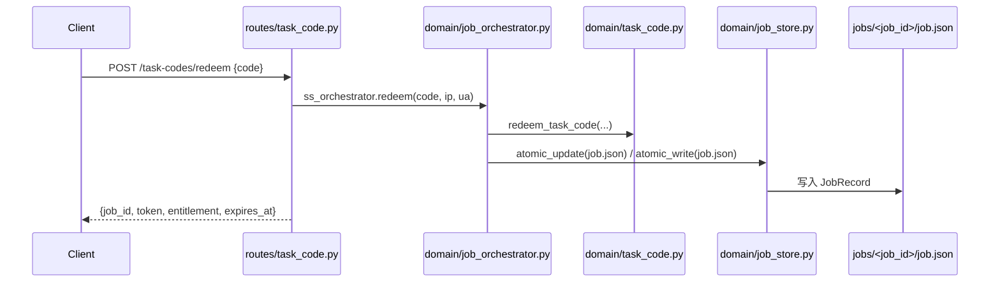
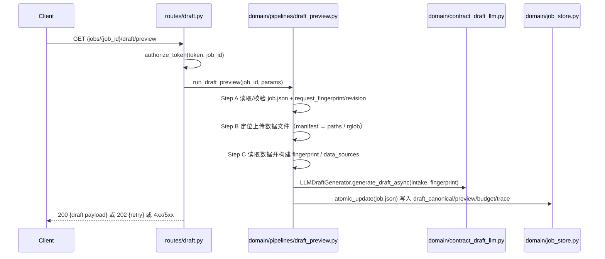
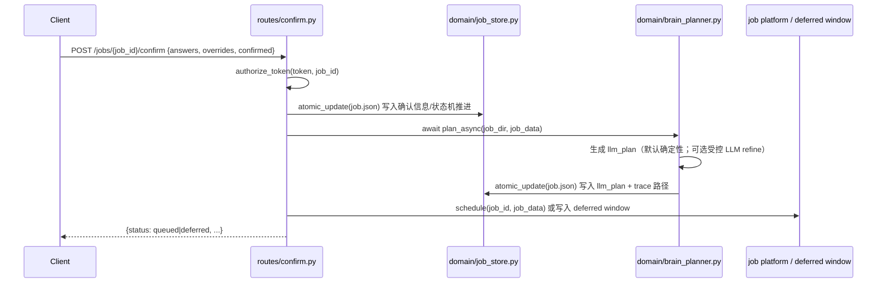

# Legacy Analysis — stata_service 核心链路调研（Phase 0）

目标：为 SS 新架构“从零重构”提供最小可用链路依据。本报告只做**理解与取舍**，不复制旧代码实现。

调研对象：`/home/leeky/work/stata_service`（只读）。

---

## 1. 核心 API 端点（来自 `routes/*.py`）

与“最小三链路”直接相关的端点：

- `POST /task-codes/redeem`（`routes/task_code.py`）：兑换任务码 → 获取 `job_id`/`token`，并落盘 `job.json`（相当于创建 Job 的入口）。
- `GET /jobs/{job_id}/draft/preview`（`routes/draft.py`）：读取 job + 扫描数据文件 → 调用 LLM 生成草案 → 写回 job.json → 返回草案 UI payload。
- `POST /jobs/{job_id}/confirm`（`routes/confirm.py`）：写入用户确认/修正 → 生成/冻结 `llm_plan` → 进入 queued/deferred 并调度执行。

说明：旧仓库没有显式 `POST /jobs`；“创建 Job”语义主要由 task-code 兑换链路承担。

---

## 2. 链路 1：创建 Job（Task Code Redeem）

### 2.1 调用链（HTTP → 业务 → 持久化 → 响应）

入口：`routes/task_code.py::api_task_code_redeem`



### 2.2 必要函数清单（建议保留的“核心职责”）

- `routes/task_code.py::api_task_code_redeem`
- `domain/job_orchestrator.py::JobOrchestrator.redeem`
- `domain/task_code.py::redeem_task_code`（校验/限流/绑定 job_id）
- `domain/job_orchestrator.py::JobOrchestrator.save_job`
- `domain/job_store.py::atomic_update`（文件锁 + 原子写）

### 2.3 冗余/可丢弃点

- `routes/*` 大量 `import app_prod` + 访问全局单例：属于“全局状态耦合”，新架构应改为依赖注入（Config/Store/LLMClient 显式传入）。

---

## 3. 链路 2：Draft Preview（LLM 草案预览）

### 3.1 调用链（HTTP → 业务 → LLM → 持久化 → 响应）

入口：`routes/draft.py::api_draft_preview`

核心 pipeline：`domain/pipelines/draft_preview.py::run_draft_preview`



### 3.2 必要函数清单（建议保留的“核心职责”）

- `routes/draft.py::api_draft_preview`（HTTP 薄层）
- `domain/pipelines/draft_preview.py::run_draft_preview`（主链路编排：A→F）
- `domain/contract_draft_llm.py::LLMDraftGenerator.generate_draft_async`（LLM 单一入口之一）
- `domain/job_store.py::atomic_update`（落盘一致性）
- `domain/job_model.py::JobModel.model_validate`（schema 防御）

### 3.3 冗余/可丢弃点（以及原因）

- **“症状治疗”型依赖：为了绕开循环导入而做的动态取模块**
  - `domain/pipelines/draft_preview.py` 中的 `_ap()`（运行时 `import app_prod`）属于隐式依赖注入；读代码无法得知其依赖项，测试也依赖 monkeypatch 全局对象。
- **不推荐的 silent fallback**
  - 旧链路中存在“记录 warning 后继续”的分支，可能掩盖真实错误，导致下游拿到不一致数据。例如（节选）：

    ```python
    except Exception as e:
        logger.warning("SS_DRAFT_CACHE_HASH_FAILED", extra={...})
        pass
    ```

  - 新架构应：只在明确“可降级且语义不变”的场景降级；否则返回结构化错误并记录日志（错误码 + 上下文）。

---

## 4. 链路 3：Confirm Job（确认并调度执行）

### 4.1 调用链（HTTP → 业务 → LLM 计划（可选）→ 持久化 → 调度 → 响应）

入口：`routes/confirm.py::api_confirm_job_understanding`

关键：`domain/brain_planner.py::BrainPlanner.plan_async`（生成/冻结 `llm_plan`）



### 4.2 必要函数清单（建议保留的“核心职责”）

- `routes/confirm.py::api_confirm_job_understanding`
- `domain/job_store.py::atomic_update`
- `domain/brain_planner.py::BrainPlanner.plan_async`
- `domain/deferred_window.py` / `domain/deferred_scheduler.py`（失败可重试时的延迟窗口）
- `app_core.exports::_job_platform_schedule_from_job_json`（调度入口；新架构建议用显式 `JobScheduler` 接口替代）

### 4.3 冗余/可丢弃点

- Confirm 路由层承担了大量业务规则与状态机细节（文件 1600+ 行），新架构应将其下沉到 `domain/job_service.py`，HTTP 层只做参数校验与响应格式化。

---

## 5. 旧仓库关键问题（新架构必须避免）

### 5.1 动态代理/隐式依赖（IDE 不可见、类型不可知）

旧仓库存在“模块属性代理”用于绕循环导入（节选）：

```python
class _ModuleAttrProxy:
    def __getattr__(self, name: str):
        return getattr(getattr(_ap(), self._attr_name), name)
```

问题：
- 签名不可知（IDE 无法跳转/补全，类型检查失效）
- 运行时才发现属性缺失
- 真实依赖隐藏在 `_ap()`（全局模块）里，导致耦合越来越深

### 5.2 超大文件/超大函数（不可测、不可审）

- `routes/draft.py`：2627 行
- `routes/confirm.py`：1669 行

这类文件通常同时处理：鉴权、文件扫描、缓存、LLM 调用、持久化、响应构造，导致单元测试与重构代价极高。

### 5.3 异常处理不一致（存在“记录后吞错”的路径）

旧链路中出现 `logger.warning(...); pass` 这类“吞异常继续走”的策略；新架构需坚持：
- 只捕获**具体异常类型**
- 返回结构化错误（`error_code` + `message`）
- 记录可检索日志事件（例如 `SS_XXX_FAILED` + extra 上下文）

---

## 6. 面向重构的“必要 vs 冗余”结论

### 必要（保留概念，但重写实现）

- job.json 的**并发安全写入**（文件锁 + 原子写）与 schema validate
- Draft Preview：输入收集 → fingerprint → LLM → 产出 draft artifacts → UI payload
- Confirm：写入用户确认 → 生成/冻结执行计划（`llm_plan`）→ 调度执行

### 冗余/历史兼容（新架构可以不做）

- 动态代理（`__getattr__`、`_ap()` 延迟取模块）与全局单例 re-export
- 兼容路由 `/jobs/{id}/preview`（可以在新架构保留重定向/alias，但不是核心）
- 多处重复的 request helper（token/ip/ua 提取）散落在 routes（应收敛到依赖注入或中间件，且保持薄）

