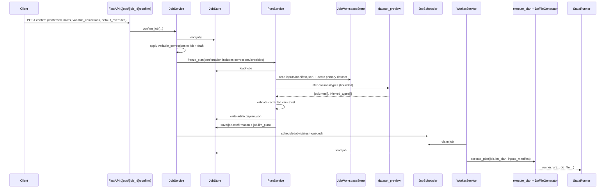

# Spec: backend-stata-proxy-extension

## Purpose

补齐 SS 新后端的 **Proxy Layer（API + domain service）** 能力，使其在用户交互侧对齐旧版 `stata_service` 的关键行为，而不改变现有 Execution Engine（`src/domain/composition_exec/` 等）的成熟执行链路。

本升级聚焦三件事：

1. **变量纠偏（variable_corrections）**：`POST /jobs/{job_id}/confirm` 接收用户提交的列名映射，并以 *token 边界* 的方式安全替换，确保后续冻结的契约/计划/Do-file 与用户纠偏一致。
2. **结构化草案预览（structured draft preview）**：`GET /jobs/{job_id}/draft/preview` 返回结构化字段（outcome/treatment/controls、候选列、数据源、类型推断等），而不仅是 `draft_text`。
3. **契约冻结校验（contract freeze validation）**：冻结 plan（confirm/freeze）前做“列名交叉验证”，阻止不存在的变量名进入可执行阶段。

## Requirements

### Requirement: Functional goals are implemented in the proxy layer

系统 MUST 实现以下后端能力（以 API 契约 + domain service 行为为准）：

- confirm 时接收并落盘 `variable_corrections`，并对确认后使用的文本/结构字段做一致性替换。
- draft preview 返回结构化响应，至少包含 outcome/treatment/controls、column_candidates、data_sources、variable_types。
- plan freeze 之前必须校验：纠偏后的变量名必须存在于 primary dataset 的列名集合中；失败时必须返回结构化错误（`error_code` + `message`），并且 job 不得进入 queued。

#### Scenario: Proxy-layer parity without legacy anti-patterns
- **WHEN** porting semantics from `stata_service`
- **THEN** the SS implementation stays within SS constraints (explicit DI, no dynamic proxies, no swallowed exceptions) and only ports user-facing semantics (variable corrections, structured preview, freeze validation)

### Requirement: Schema change list is explicit (domain + API)

本节是未来实现的**变更清单**；字段名与类型 MUST 精确匹配。

#### Domain models (`src/domain/models.py`)

- `class JobConfirmation`（currently: `requirement`, `notes`）
  - ADD `variable_corrections: dict[str, str] = Field(default_factory=dict)`
  - ADD `default_overrides: dict[str, JsonValue] = Field(default_factory=dict)`
- `class Draft`（currently: `text`, `created_at`, `extra="allow"`）
  - ADD `outcome_var: str | None = None`
  - ADD `treatment_var: str | None = None`
  - ADD `controls: list[str] = Field(default_factory=list)`
  - ADD `column_candidates: list[str] = Field(default_factory=list)`
  - ADD `variable_types: list[DraftVariableType] = Field(default_factory=list)`
  - ADD `data_sources: list[DraftDataSource] = Field(default_factory=list)`
  - ADD `default_overrides: dict[str, JsonValue] = Field(default_factory=dict)`
- ADD `class DraftVariableType`
  - `name: str`
  - `inferred_type: str`（与 `src/domain/dataset_preview.py` 的输出一致：`boolean|integer|number|datetime|string|unknown`）
- ADD `class DraftDataSource`
  - `dataset_key: str`
  - `role: str`（与 `src/domain/inputs_manifest.py` 一致：`primary_dataset|secondary_dataset|auxiliary_data`）
  - `original_name: str`
  - `format: str`（与 `src/domain/inputs_manifest.py` 一致：`csv|excel|dta`）

#### API schemas (`src/api/schemas.py`)

- `class ConfirmJobRequest`
  - ADD `variable_corrections: dict[str, str] = Field(default_factory=dict)`
  - ADD `default_overrides: dict[str, JsonValue] = Field(default_factory=dict)`
- `class DraftPreviewResponse`
  - KEEP `job_id: str`
  - KEEP `draft_text: str`
  - ADD `outcome_var: str | None = None`
  - ADD `treatment_var: str | None = None`
  - ADD `controls: list[str] = Field(default_factory=list)`
  - ADD `column_candidates: list[str] = Field(default_factory=list)`
  - ADD `variable_types: list[InputsPreviewColumn] = Field(default_factory=list)`（复用现有 schema）
  - ADD `data_sources: list[DraftPreviewDataSource] = Field(default_factory=list)`
  - ADD `default_overrides: dict[str, JsonValue] = Field(default_factory=dict)`
- ADD `class DraftPreviewDataSource`
  - `dataset_key: str`
  - `role: str`
  - `original_name: str`
  - `format: str`

#### Scenario: Schema changes are verifiable
- **WHEN** implementation lands and `ruff check .` and `pytest -q` are executed
- **THEN** they exit with code `0`

### Requirement: Variable corrections are token-boundary safe and deterministic

系统 MUST 兼容旧版 `_apply_variable_corrections_to_job_data` 的核心语义，并符合 SS 异常约束（禁止吞异常）。

#### Correction cleaning rules

- Input `variable_corrections` MUST be normalized by trimming whitespace for both key/value.
- Entries MUST be dropped if `old` or `new` becomes empty after trimming.
- Entries MUST be dropped if `old == new`.
- The persisted mapping MUST be the cleaned mapping (not the raw payload).

#### Replacement rule (token boundary)

For each `old -> new`, replacement MUST be:

- `pattern = re.compile(rf"(?<![A-Za-z0-9_]){re.escape(old)}(?![A-Za-z0-9_])")`
- `out = pattern.sub(new, out)`

If regex compilation fails, the implementation MAY fall back to `out.replace(old, new)`, but it MUST only catch `re.error` (no `except Exception`).

#### Replacement targets (SS v3 contract fields)

Variable corrections MUST be applied to keep UI/plan/do-file consistent:

- Text fields:
  - `Job.requirement`（if present）
  - `JobConfirmation.requirement`（effective confirmation requirement, if present）
  - `Draft.text`
- Structured variable fields:
  - `Draft.outcome_var`, `Draft.treatment_var`
  - `Draft.controls[]`
  - `Draft.default_overrides`（values only; keys MUST NOT be rewritten）

#### Scenario: Token-boundary replacement avoids substring damage
- **WHEN** the draft contains `controls=["col_a","col_a2"]` and the user confirms with `variable_corrections={"col_a":"col_b"}`
- **THEN** the effective controls become `["col_b","col_a2"]`

#### Scenario: Variable corrections are idempotent
- **WHEN** confirm is called twice with the same cleaned `variable_corrections`
- **THEN** the stored confirmation payload is stable and the derived `plan_id` remains unchanged

### Requirement: Draft preview response is structured and derived from SS sources

`GET /v1/jobs/{job_id}/draft/preview` MUST return a structured payload suitable for UI rendering and replay:

- `draft_text` MUST always be present (backwards compatibility).
- `outcome_var`, `treatment_var`, `controls`, `default_overrides` MUST come from the persisted `job.draft` (LLM output + normalization).
- `column_candidates` and `variable_types` MUST be derived from the primary dataset:
  - Column names MUST be obtained from dataset inspection (aligned with `src/domain/dataset_preview.py`).
  - `column_candidates` MUST be capped at 300 entries.
- `data_sources` MUST be derived from `inputs/manifest.json` datasets (not Excel sheets).
- If inputs are missing, `column_candidates`, `variable_types`, `data_sources` MUST be empty lists (not `null`).

#### Scenario: Draft preview includes dataset-derived columns
- **WHEN** a primary dataset with columns `["y","treat","x1"]` is uploaded for a job
- **THEN** draft preview returns `column_candidates` containing those names and `variable_types` entries for each

### Requirement: Contract freeze validates variable names against uploaded dataset columns

Plan freeze is treated as contract freeze: once frozen, the job is runnable and must be reproducible.

#### Validation rules

- Before persisting `job.llm_plan` (writing `artifacts/plan.json`), the system MUST validate that effective variable names exist in the primary dataset column set.
- Validation MUST run after variable corrections are applied.
- Variables to validate:
  - `Draft.outcome_var` (if not `null`)
  - `Draft.treatment_var` (if not `null`)
  - each item in `Draft.controls`
- On failure, the API MUST return HTTP 400 with SS error schema:
  - `{"error_code":"CONTRACT_COLUMN_NOT_FOUND","message":"..."}`
  - Missing details MUST be included in the `message` (because current SS error schema is `error_code` + `message` only).
- The job MUST NOT transition to `queued` on validation failure.

#### Determinism rule

The frozen `plan_id` MUST change when confirmation payload changes. Specifically, `variable_corrections` and `default_overrides` MUST be part of the confirmation object hashed by `src/domain/plan_service.py` (therefore they must be modeled in `JobConfirmation`).

#### Scenario: Freeze rejects corrected-to-missing column names
- **WHEN** the user confirms with `variable_corrections={"col_a":"col_missing"}`
- **THEN** the response is HTTP 400 with `error_code="CONTRACT_COLUMN_NOT_FOUND"` and a `message` that mentions `col_missing`, and the job status is not `queued`

### Requirement: Service-layer change list is explicit

本节描述未来实现中 `DraftService` / `PlanService` / `JobService` 的改动要点。

#### DraftService (`src/domain/draft_service.py`)

- MUST persist structured draft fields alongside `Draft.text` (outcome/treatment/controls/default_overrides) so the preview endpoint is replayable.
- SHOULD enrich draft preview with dataset-derived fields when inputs exist:
  - `data_sources` from inputs manifest datasets
  - `column_candidates` and `variable_types` from dataset inspection

#### PlanService (`src/domain/plan_service.py`)

- MUST include `variable_corrections` and `default_overrides` in the confirmation model so they participate in plan id hashing.
- MUST run contract freeze validation before writing `artifacts/plan.json` and before persisting `job.llm_plan`.

#### JobService (`src/domain/job_service.py`)

- `confirm_job(...)` MUST accept `variable_corrections` and `default_overrides` (from API payload) and pass them into the freeze call.
- MUST apply variable corrections before freeze/queue so downstream do-file generation uses corrected names.

#### Scenario: Domain stays FastAPI-free
- **WHEN** implementing these changes
- **THEN** `src/domain/` does not import FastAPI; API layer only performs request/response shaping

### Requirement: API endpoint contracts are explicit (Request/Response JSON)

#### Endpoint: `GET /v1/jobs/{job_id}/draft/preview`

Response body (HTTP 200):

```json
{
  "job_id": "0123456789abcdef0123456789abcdef",
  "draft_text": "[stub-draft:3f8a1b2c3d4e] ...",
  "outcome_var": "y",
  "treatment_var": "treat",
  "controls": ["x1", "x2"],
  "column_candidates": ["y", "treat", "x1", "x2"],
  "variable_types": [
    {"name": "y", "inferred_type": "number"},
    {"name": "treat", "inferred_type": "integer"}
  ],
  "data_sources": [
    {"dataset_key": "ds_1a2b3c4d5e6f7081", "role": "primary_dataset", "original_name": "main.csv", "format": "csv"}
  ],
  "default_overrides": {}
}
```

#### Endpoint: `POST /v1/jobs/{job_id}/confirm`

Request body:

```json
{
  "confirmed": true,
  "notes": "Proceed with corrections.",
  "variable_corrections": {"col_a": "col_b"},
  "default_overrides": {"cluster_se": "id"}
}
```

Success response (HTTP 200):

```json
{
  "job_id": "0123456789abcdef0123456789abcdef",
  "status": "queued",
  "scheduled_at": "2026-01-08T10:00:00Z"
}
```

Failure response (HTTP 400, contract validation failure):

```json
{
  "error_code": "CONTRACT_COLUMN_NOT_FOUND",
  "message": "One or more variables are not present in the primary dataset columns: missing=col_missing"
}
```

#### Endpoint: `POST /v1/jobs/{job_id}/plan/freeze`

Request body:

```json
{
  "notes": "Freeze contract for execution."
}
```

Success response (HTTP 200, shape unchanged from current SS):

```json
{
  "job_id": "0123456789abcdef0123456789abcdef",
  "plan": {
    "plan_version": 1,
    "plan_id": "7d1e5f2a3b4c5d6e7f8a9b0c1d2e3f4a5b6c7d8e9f0a1b2c3d4e5f6a7b8c9d0e",
    "rel_path": "artifacts/plan.json",
    "steps": [
      {
        "step_id": "generate_do",
        "type": "generate_stata_do",
        "params": {
          "composition_mode": "sequential",
          "template_id": "stub_descriptive_v1",
          "input_bindings": {"primary_dataset": "input:primary"},
          "products": [],
          "requirement_fingerprint": "5c4a7e3a2d1f0b9c8d7e6f5a4b3c2d1e0f9a8b7c6d5e4f3a2b1c0d9e8f7a6b5c"
        },
        "depends_on": [],
        "produces": ["stata.do"]
      },
      {
        "step_id": "run_stata",
        "type": "run_stata",
        "params": {
          "composition_mode": "sequential",
          "timeout_seconds": 300,
          "products": [{"product_id": "summary_table", "kind": "table"}]
        },
        "depends_on": ["generate_do"],
        "produces": [
          "run.stdout",
          "run.stderr",
          "stata.log",
          "stata.export.table",
          "run.meta.json",
          "run.error.json"
        ]
      }
    ]
  }
}
```

#### Scenario: Endpoint contracts are stable for clients
- **WHEN** clients call the endpoints above
- **THEN** they receive the exact JSON shapes defined here

### Requirement: Dataflow from confirm to StataRunner (Mermaid)



#### Scenario: Contract freeze happens before queueing
- **WHEN** a job is confirmed with `confirmed=true`
- **THEN** freeze validation happens before the job transitions to `queued`

### Requirement: Acceptance criteria are explicit and testable

实现阶段 MUST 增加以下验收测试（pytest 名称为可执行规格）：

- `test_confirm_job_with_variable_corrections_rewrites_effective_dofile_tokens()`
  - 断言：纠偏后生成的 do-file 中，变量名以 token 边界替换（避免误伤更长标识符）。
- `test_variable_corrections_token_boundary_does_not_replace_substrings()`
  - 断言：`col_a` 替换不影响 `col_a2`。
- `test_confirm_job_when_column_missing_returns_contract_column_not_found()`
  - 断言：冻结前列名校验失败时返回 HTTP 400 + `error_code="CONTRACT_COLUMN_NOT_FOUND"`，且 job 不进入 queued。
- `test_plan_id_changes_when_confirmation_payload_changes()`
  - 断言：修改 `variable_corrections/default_overrides` 会改变 `plan_id`，且已冻结 plan 的冲突行为保持可解释。

#### Scenario: Acceptance is verifiable locally
- **WHEN** running `pytest -q` after implementation
- **THEN** the tests above pass
