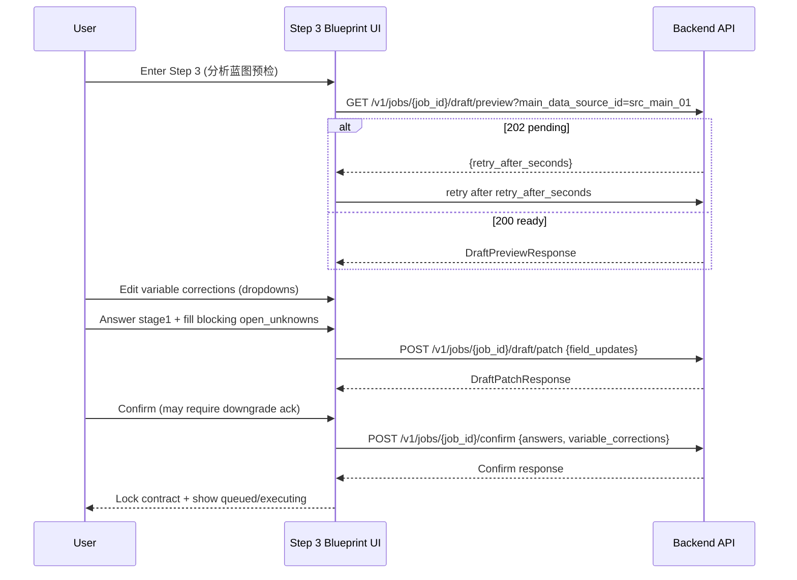

# Spec: frontend-stata-proxy-extension

## Purpose

Upgrade the Premium “Desktop Pro” frontend (`index.html`) with the legacy-proven professional confirmation UX for Step 3 “分析蓝图预检” (variable corrections, clarification gating, data-quality warnings, contract lockdown), while preserving the existing visual design system.

## Background

Current `index.html` provides a high-fidelity Linear/Cursor-style UI, but Step 3 is a static preview table and does not implement the validated interaction logic from:
- `legacy/stata_service/frontend/src/components/DraftPreview.tsx` (variable mapping + warnings surface)
- `legacy/stata_service/frontend/src/components/ConfirmationStep.tsx` (confirm gating + state machine)
- `legacy/stata_service/frontend/src/api/stataService.ts` (DraftPreviewResponse + patch/confirm contracts)

This spec defines: functional goals, required UI components, the Step 3 interaction flow (Mermaid), and the API consumption contract (JSON) expected by the frontend.

## Related specs (normative)

- API surface + versioning: `openspec/specs/ss-api-surface/spec.md`
- Plan freeze/preview user path: `openspec/specs/ss-ux-loop-closure/spec.md`
- Proxy parity (backend): `openspec/specs/backend-stata-proxy-extension/spec.md`

## Functional goals (user-visible)

- Variable corrections: users correct wrongly-detected variable names via dropdowns sourced from detected column candidates.
- Clarification gating: users answer all blocking multiple-choice questions and resolve blocking open unknowns before confirming.
- Data-quality warnings: users see actionable warnings (severity + suggestion) before confirmation.
- Contract lockdown: once confirmed, Step 3 becomes read-only and clearly indicates the job is queued/executing.

## UI/UX component inventory (新增/修改点)

All components MUST reuse the existing design primitives (`panel`, `section-label`, `btn`, `data-table`, `mono`) and MUST NOT introduce a new visual system.

- Blueprint header (existing `#view-blueprint`): decision badge + draft status line.
- Data quality warnings panel (new, collapsible): severity + message + suggestion.
- Variable mapping card (new, collapsible “修正变量映射”): dependent/treatment/control dropdowns + “清除修正”.
- Clarification panel (new): stage1 questions + open_unknowns inputs + “应用澄清并刷新预览”.
- Confirm controls (modify existing “启动分析任务”): confirm disabled by gating; downgrade-risk modal; post-confirm locked banner.

## Requirements

### Requirement: Step 3 MUST load and render a draft preview for the selected dataset

Entering Step 3 (`#view-blueprint`) MUST trigger draft preview loading for the current `job_id` and selected `main_data_source_id` (if applicable).

#### Scenario: Step 3 loads draft preview successfully
- **GIVEN** a job has an uploaded dataset and a selected main data source (sheet)
- **WHEN** the user enters Step 3 “分析蓝图预检”
- **THEN** the frontend calls `GET /v1/jobs/{job_id}/draft/preview?main_data_source_id=src_main_01`
- **AND** the UI renders the draft preview table plus the new panels (warnings, mapping, clarifications)

#### Scenario: Draft preview pending (202) is handled as “预处理中”
- **GIVEN** the backend returns HTTP `202` with `retry_after_seconds`
- **WHEN** the frontend receives the response
- **THEN** the UI shows a non-error “预处理中” state and automatically retries after `retry_after_seconds`

### Requirement: Variable corrections MUST be editable and MUST use stable candidate columns

The frontend MUST maintain `variableCorrections: Record<string, string>` and use it to display corrected variables without mutating the original draft payload.
Candidate options MUST be computed as: (1) `draft.column_candidates` if non-empty; else (2) `draft.variable_types[].name`; else (3) the currently displayed variables as a last-resort fallback.

#### Scenario: User corrects a mis-detected dependent variable via dropdown
- **GIVEN** the draft preview shows `DEPENDENT = "roe"` and candidate columns include `"profitability"`
- **WHEN** the user expands “修正变量映射” and selects `"profitability"` for the dependent variable dropdown
- **THEN** `variableCorrections["roe"]` becomes `"profitability"`
- **AND** the blueprint variable table displays `DEPENDENT = "profitability"`

#### Scenario: Clearing corrections resets to original variables
- **GIVEN** `variableCorrections` contains at least one mapping
- **WHEN** the user clicks “清除修正”
- **THEN** `variableCorrections` becomes an empty object
- **AND** the blueprint variable table reverts to the original draft variables

### Requirement: Blocking Stage 1 questions MUST gate confirmation

Stage 1 questions (`draft.stage1_questions`) MUST be rendered as blocking multi/single-choice inputs, and the confirm action MUST NOT proceed unless all Stage 1 questions have at least one selected option.

#### Scenario: Missing Stage 1 answers prevents confirmation
- **GIVEN** the draft includes at least one `stage1_question`
- **WHEN** the user clicks “确认并启动” with any unanswered Stage 1 question
- **THEN** the UI shows a validation error state
- **AND** no confirm API call is made

### Requirement: Blocking open unknowns MUST be resolvable via draft patch before confirmation

Open unknowns (`draft.open_unknowns`) MUST be displayed and classified as blocking when `unknown.blocking == true` OR `unknown.impact` is `high`/`critical`.
If the user provided any inline clarifications, the frontend MUST call draft patch before confirm.

#### Scenario: User patches blocking unknowns and remaining blockers are enforced
- **GIVEN** the draft contains a blocking `open_unknown` with `field="panel_id"` and `impact="high"`
- **WHEN** the user fills `clarifications["panel_id"]="firm_id"` and clicks “应用澄清并刷新预览”
- **THEN** the frontend calls `POST /v1/jobs/{job_id}/draft/patch` with `field_updates={"panel_id":"firm_id"}`
- **AND** the UI updates the preview using `draft_preview` from the patch response
- **AND** the confirm button remains disabled if any blocking unknowns remain

### Requirement: Data quality warnings MUST be visible before confirmation

If `draft.data_quality_warnings` is non-empty, the UI MUST display a warnings panel with severity, message, and suggestion (when present).

#### Scenario: Warnings are shown with severity and suggestion
- **GIVEN** the draft preview includes a warning item `{severity:"warning", message:"缺失值比例较高", suggestion:"考虑删除缺失严重变量"}`
- **WHEN** Step 3 renders
- **THEN** the user can see the warning message and suggestion before confirming

### Requirement: Confirmation MUST lock the contract and transition UI to read-only

On confirm, the frontend MUST call `POST /v1/jobs/{job_id}/confirm` with `answers` and `variable_corrections` (and empty objects for `default_overrides` and `expert_suggestions_feedback` in v1 unless implemented).
After a successful confirm response, the UI MUST enter a locked state: mapping/clarification inputs disabled; primary action navigates to the query view.

#### Scenario: Confirmation locks the blueprint UI and shows queued state
- **GIVEN** all Stage 1 questions are answered and no blocking open unknowns remain
- **WHEN** the user clicks “确认并启动”
- **THEN** the frontend calls `POST /v1/jobs/{job_id}/confirm` with `confirmed=true`
- **AND** on success the UI shows “需求已确认，任务已加入执行队列” and disables further edits

#### Scenario: Downgrade-risk confirmation requires explicit user acknowledgment
- **GIVEN** `draft.decision = "require_confirm_with_downgrade"`
- **WHEN** the user clicks “确认并启动”
- **THEN** the UI shows a downgrade-risk confirmation modal
- **AND** the confirm API call happens only after the user explicitly confirms

### Requirement: Step 3 interaction flow MUST match the defined state transitions

The Step 3 implementation MUST follow the interaction flow below, including dropdown variable corrections and confirm-lock transition.



#### Scenario: Implementation follows preview → patch → confirm sequence
- **WHEN** reviewing the Step 3 implementation in `index.html` (or its future refactor target)
- **THEN** it issues preview first, then optional patch, and only then confirm
- **AND** it never allows confirmation while any blocking items remain unresolved

### Requirement: Frontend MUST consume a stable API contract (draft v1)

The frontend MUST treat the following API shapes (JSON) under `/v1` as a stable dependency and MUST remain backward compatible once shipped.

#### Scenario: Draft preview response contains correction + gating inputs
- **WHEN** the frontend receives a draft preview response
- **THEN** it can render variable corrections, Stage 1 questions, and open unknowns without additional calls

API: `GET /v1/jobs/{job_id}/draft/preview`

- Success (HTTP 200): `DraftPreviewResponse` (subset shown)
  - `draft_id`: string
  - `decision`: `"auto_freeze" | "require_confirm" | "require_confirm_with_downgrade"`
  - `risk_score`: number
  - `status`: string
  - `outcome_var`: string|null
  - `treatment_var`: string|null
  - `controls`: string[]
  - `column_candidates`: string[] (optional)
  - `data_quality_warnings`: `{type,severity,message,suggestion}`[] (optional)
  - `stage1_questions`: `{question_id,question_text,question_type,options,priority}`[]
  - `open_unknowns`: `{field,description,impact,blocking?,candidates?}`[]

Example (HTTP 200):
```json
{"draft_id":"drf_72k9s1","decision":"require_confirm","risk_score":42,"status":"generated","outcome_var":"roe","treatment_var":"esg_score","controls":["size","lev","age"],"column_candidates":["profitability","esg_score","size","lev","age","year","firm_id"],"data_quality_warnings":[{"type":"missing_rate","severity":"warning","message":"缺失值比例较高","suggestion":"考虑删除缺失严重变量"}],"stage1_questions":[{"question_id":"q_panel","question_text":"数据是否为面板数据？","question_type":"single_choice","priority":1,"options":[{"option_id":"yes","label":"是","value":true},{"option_id":"no","label":"否","value":false}]}],"open_unknowns":[{"field":"panel_id","description":"请选择个体ID列","impact":"high","blocking":true,"candidates":["firm_id"]}]}
```

- Pending (HTTP 202):
```json
{"status":"pending","message":"预处理中","retry_after_seconds":5,"retry_until":"2026-01-08T10:00:00Z"}
```

API: `POST /v1/jobs/{job_id}/draft/patch`

Request:
```json
{"field_updates":{"panel_id":"firm_id"}}
```

Response:
```json
{"status":"patched","patched_fields":["panel_id"],"remaining_unknowns_count":0,"open_unknowns":[],"draft_preview":{"goal_type":"causal","outcome_var":"roe","treatment_var":"esg_score","controls":["size","lev","age"]}}
```

API: `POST /v1/jobs/{job_id}/confirm`

Request:
```json
{"confirmed":true,"variable_corrections":{"roe":"profitability"},"answers":{"q_panel":["yes"]},"default_overrides":{},"expert_suggestions_feedback":{}}
```

Response (minimum frontend-needed fields):
```json
{"job_id":"jb_72k9s1","status":"queued","message":"confirmed"}
```

### Requirement: Acceptance tests MUST cover the critical user path

The release MUST provide reproducible acceptance coverage for the following critical paths (manual or automated).

#### Scenario: Upload Excel → correct dependent var → confirm locks contract
- **GIVEN** a user uploads an Excel file containing a column named `"profitability"`
- **AND** the draft preview identifies `"roe"` as `DEPENDENT`
- **WHEN** the user corrects `"roe"` to `"profitability"` via the dropdown and completes all blocking confirmations
- **THEN** the confirm request includes `variable_corrections={"roe":"profitability"}`
- **AND** the UI enters the locked state with a queued/executing status indication

#### Scenario: Unanswered blocking question prevents confirm
- **GIVEN** the draft includes at least one Stage 1 blocking question
- **WHEN** the user attempts to confirm without answering it
- **THEN** the UI blocks confirmation and displays a validation error

## Task cards

Task cards for this spec live under: `openspec/specs/frontend-stata-proxy-extension/task_cards/`.

- FE-B001: Step 3 draft preview loading + pending state handling
- FE-B002: Variable corrections mapping UI (dropdowns + clear)
- FE-B003: Clarification gating (stage1 questions + open_unknowns + patch flow)
- FE-B004: Confirm + contract lockdown (read-only state + queued UX)
- FE-B005: Data quality warnings surface (severity + suggestion)

