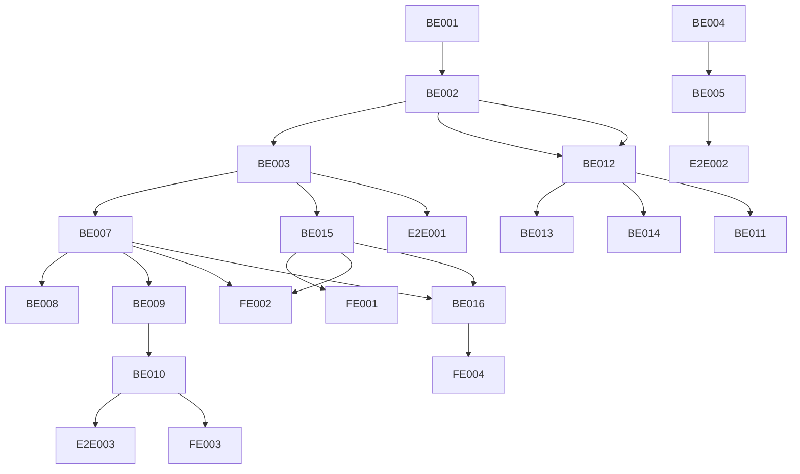

# Task cards: ss-full-auto-orchestration

本目录将“SS 全自动代劳服务（全链路编排）”拆成**独立可执行**、可验收的任务卡（Backend / Frontend / E2E）。

## 任务卡索引

| ID | Priority | Area | Title | Dependencies |
| --- | --- | --- | --- | --- |
| BE-001 | P0 | Backend | FullPipelinePlanGenerator Prompt 设计 | 无 |
| BE-002 | P0 | Backend | plan_generation_llm.py 增强（多步解析） | BE-001 |
| BE-003 | P0 | Backend | composition_exec 多步 Plan 端到端测试 | BE-002 |
| BE-004 | P0 | Backend | RobustnessStrategyService 接口定义 | BE-001 |
| BE-005 | P0 | Backend | 稳健性规则库实现（OLS/FE基础） | BE-004 |
| BE-006 | P1 | Backend | 稳健性规则库扩展（DID/PSM/RDD/IV） | BE-005 |
| BE-007 | P0 | Backend | ReportAggregationService 接口定义 | BE-003 |
| BE-008 | P0 | Backend | 汇总表生成器实现 | BE-007 |
| BE-009 | P0 | Backend | PaperWritingService 接口定义 | BE-007 |
| BE-010 | P0 | Backend | 论文段落 Prompt 实现（方法/结果） | BE-009 |
| BE-011 | P1 | Backend | 论文段落 Prompt 实现（稳健性/机制） | BE-010, BE-012 |
| BE-012 | P1 | Backend | MechanismHeterogeneityPlanner 接口 | BE-002 |
| BE-013 | P1 | Backend | 中介效应模板组（Baron-Kenny/Sobel/Bootstrap） | BE-012 |
| BE-014 | P1 | Backend | 分组回归模板组 | BE-012 |
| BE-015 | P1 | Backend | 执行进度追踪 API | BE-003 |
| BE-016 | P2 | Backend | OutputPackagingService（ZIP打包） | BE-007, BE-015 |
| FE-001 | P1 | Frontend | Pipeline 执行进度展示 | BE-015 |
| FE-002 | P1 | Frontend | 多步结果分step展示 | BE-007, BE-015 |
| FE-003 | P1 | Frontend | 论文段落预览与复制 | BE-010 |
| FE-004 | P2 | Frontend | 结果打包下载按钮 | BE-016 |
| E2E-001 | P0 | E2E | 完整链路执行验证（5步以上） | BE-003 |
| E2E-002 | P0 | E2E | 稳健性自动规划验证 | BE-005 |
| E2E-003 | P0 | E2E | 论文段落生成验证 | BE-010 |

## 执行 Wave 规划（参考蓝图 Phase）

### Wave / Phase 1（2周）：完整链路规划（P0）

- BE-001, BE-002, BE-003
- E2E-001

### Wave / Phase 2（1周）：稳健性自动规划（P0→P1）

- BE-004, BE-005
- E2E-002
- （扩展）BE-006

### Wave / Phase 3（2周）：结果聚合与论文写作（P0）

- BE-007, BE-008, BE-009, BE-010
- E2E-003

### Wave / Phase 4（1周）：机制与异质性规划（P1）

- BE-012, BE-013, BE-014, BE-011

### Wave / Phase 5（1周）：用户体验增强（P1/P2）

- BE-015, FE-001, FE-002, FE-003
- （可选）BE-016, FE-004

## 依赖关系图（简化）



## 执行约定（强制）

- 每张卡必须包含：问题描述 / 技术分析 / 解决方案 / 验收标准 / Dependencies。
- 所有失败路径必须返回结构化错误（`error_code` + `message`），并同步维护 `ERROR_CODES.md`（见 `ss-api-surface`）。
- 计划与产物必须可审计：LLM 调用必须落盘 artifacts（见 `ss-llm-brain`）。
- Job 状态流转必须走 domain 状态机；并发写必须使用 `job.version` 乐观锁（见 `ss-state-machine` 与 `ss-job-store`）。
- 前端 API types 为自动生成文件，禁止手改；任何 API 变更按“后端先改 → 生成 types → 前端适配”流程执行。

## 任务卡格式要求

每张任务卡必须符合以下骨架（允许增补，但不得缺项）：

```md
# Task Card: <ID> <标题>
- Priority: P0/P1/P2
- Area: Backend / Frontend / E2E
- Design refs:
  - `openspec/specs/ss-full-auto-orchestration/design/<xxx>.md`
## 问题描述
...
## 技术分析
- 影响：...
- 代码定位锚点：
  - `src/domain/xxx.py`
## 解决方案
1. ...
## 验收标准
- [ ] ...
## Dependencies
- <ID> / 无
```

