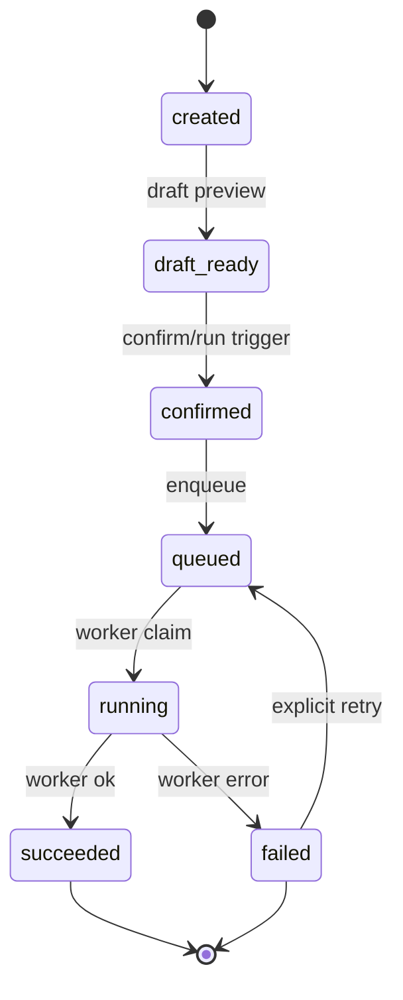
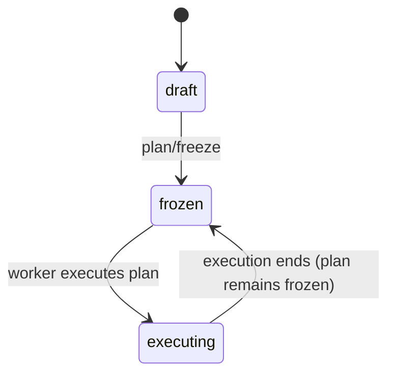
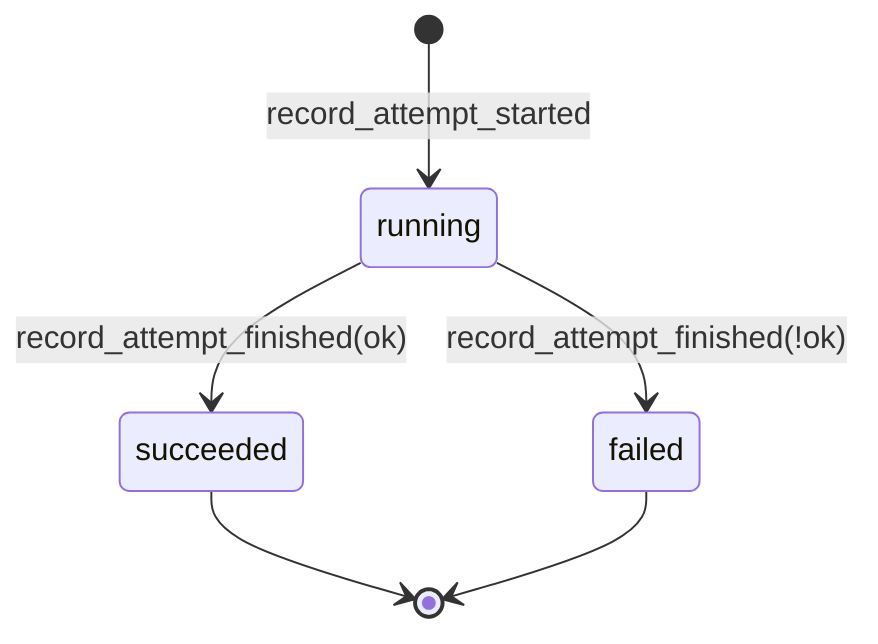
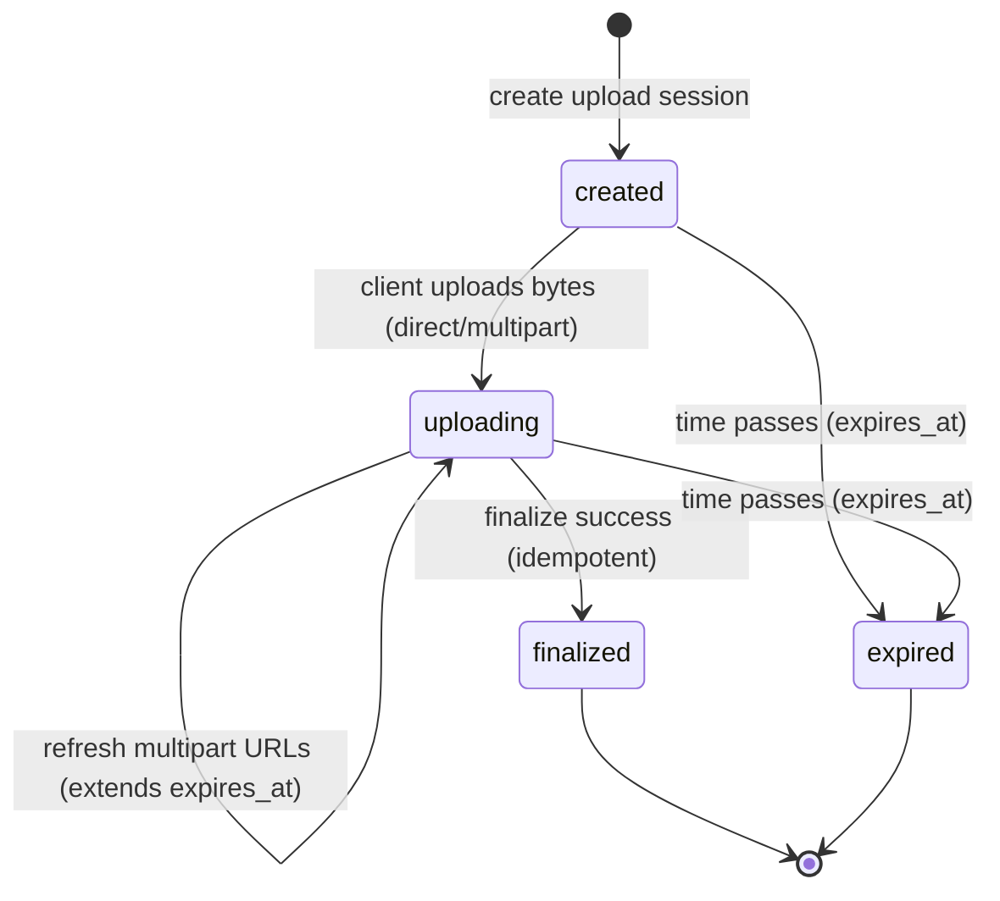
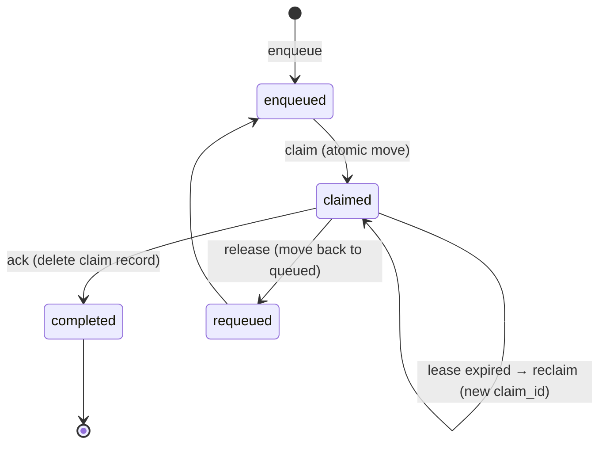

# SS System State Machines (Code-Verified)

This document describes SS core state machines as implemented in `src/` (not an aspirational model).

## Job state machine (`job.json.status`)

### States (enum)

Defined in `src/domain/models.py` (`JobStatus`):
- `created`
- `draft_ready`
- `confirmed`
- `queued`
- `running`
- `succeeded`
- `failed`

Allowed transitions are enforced by `src/domain/state_machine.py` (`_ALLOWED_TRANSITIONS`).

### Mermaid

### Transition conditions + code pointers

- `created → draft_ready`
  - Condition: a draft preview is successfully generated and persisted for a `created` job.
  - Code: `src/domain/draft_service.py` (`DraftService._preview_for_loaded_job`)
- `draft_ready → confirmed → queued`
  - Condition: a run is triggered (via `/jobs/{job_id}/run` or `/jobs/{job_id}/confirm`) and plan freeze succeeds; queuing is idempotent.
  - Code: `src/domain/job_service.py` (`JobService.trigger_run`, `JobService._queue_run`)
  - Plan freeze: `src/domain/job_plan_freeze.py` (`freeze_plan_for_run`) → `src/domain/plan_service.py` (`PlanService.freeze_plan`)
- `queued → running`
  - Condition: worker claims the queue item and the job is claimable; transition is enforced and persisted before execution begins.
  - Code: `src/domain/worker_claim_handling.py` (`ensure_job_claimable`)
- `running → succeeded|failed`
  - Condition: worker finishes (success), or reaches non-retriable error / max attempts (failure).
  - Code: `src/domain/worker_service.py` (`WorkerService._finish_job`)
- `failed → queued`
  - Condition: explicit retry trigger for failed jobs.
  - Code: `src/domain/job_retry.py` (`retry_failed_job`)

### Validation notes

- No dead states: all enum values have at least one entering path in `src/domain/` (`draft_service`, `job_service`, `worker_*`).
- No hard deadlock at the state-machine layer: `failed` is terminal unless retried; `running` will only exit on worker completion (or a crash + later re-claim).

## Plan state machine (derived from `job.json.llm_plan`)

SS does not currently define a `PlanStatus` enum; plan “state” is derived from job fields.

### States (derived)

- `draft` (unfrozen): `job.llm_plan is None`
- `frozen`: `job.llm_plan is not None` (and plan artifact exists under job workspace)
- `executing`: worker is executing the frozen plan (typically `job.status in {running}`)

### Mermaid

### Transition conditions + code pointers

- `draft → frozen`
  - Condition: plan freeze succeeds and persists `job.llm_plan` (idempotent only when `plan_id` matches).
  - Code: `src/domain/plan_service.py` (`PlanService.freeze_plan`)
  - Entry points:
    - API: `src/api/jobs.py` (`POST /jobs/{job_id}/plan/freeze`)
    - Run trigger: `src/domain/job_service.py` (`JobService.trigger_run`) → `src/domain/job_plan_freeze.py` (`freeze_plan_for_run`)
- `frozen → executing`
  - Condition: worker executes the plan; execution fails early with `PLAN_MISSING` if `job.llm_plan` is absent.
  - Code: `src/domain/worker_plan_execution.py` (`execute_in_dirs`)

### Validation notes

- The plan can be frozen only when `job.status in {draft_ready, confirmed}` (`src/domain/plan_service.py` → `_ensure_freeze_allowed`).
- The worker execution path treats missing plans as non-retriable (`PLAN_MISSING` is in `src/domain/worker_service.py` `_NON_RETRIABLE_ERROR_CODES`).

## Run attempt state machine (`job.json.runs[]`)

Run attempts are represented by `RunAttempt` records (no dedicated enum; string values are used).

### States (observed in code)

- `running`
- `succeeded`
- `failed`

### Mermaid

### Transition conditions + code pointers

- Attempt start: append `RunAttempt(status="running")`
  - Code: `src/domain/worker_run_attempts.py` (`record_attempt_started`)
- Attempt finish: set `attempt.status = "succeeded" | "failed"`
  - Code: `src/domain/worker_run_attempts.py` (`record_attempt_finished`)
- Attempt retries: a new attempt is appended (attempt number increments); job stays `running` until final success/failure.
  - Code: `src/domain/worker_service.py` (`WorkerService._run_job_with_retries`)

### Validation notes

- There is no persisted `pending` state for attempts; “pending” exists at the job/queue level (`job.status=queued` before the worker starts an attempt).

## Upload session state machine (`inputs/upload_sessions/*.json`)

SS does not currently define an `UploadSessionStatus` enum; upload session “state” is derived from persisted fields.

### States (derived)

- `created` / `uploading`: session exists, `finalized is None`, and `now < expires_at`
- `finalized`: `finalized is not None` (`finalize.status` is currently `"finalized"`)
- `expired`: `now >= expires_at` (operations raise `UPLOAD_SESSION_EXPIRED`)

### Mermaid

### Transition conditions + code pointers

- Create session: persist `UploadSessionRecord(finalized=None, expires_at=...)`
  - Code: `src/domain/upload_sessions_issuer.py` (`UploadSessionIssuer.issue`)
  - Persistence: `src/infra/file_upload_session_store.py` (`FileUploadSessionStore.save_session`)
- Refresh multipart URLs: update `expires_at` (multipart only)
  - Code: `src/domain/upload_sessions_refresher.py` (`UploadSessionRefresher.refresh`)
- Finalize:
  - Success: set `session.finalized` and persist; subsequent finalize calls return the same success payload.
  - Failure: returns `{"success": false, ...}` without changing `finalized` (client may retry).
  - Code: `src/domain/upload_sessions_finalizer.py` (`UploadSessionFinalizer.finalize`)
- Expired:
  - Code: `src/domain/upload_sessions_refresher.py` / `src/domain/upload_sessions_finalizer.py` (both enforce expiry)

### Validation notes

- No dead state: sessions are always “created/uploading” until they are finalized or expire.
- Error paths are explicit: finalize returns a tagged-union payload and expiry raises structured errors.

## Worker task (queue record) state machine (file queue)

The worker “task state” is represented by file placement under the queue directory (not by a `WorkerTaskStatus` enum).

### States (derived)

- `enqueued`: `queue/queued/<tenant?>/<job_id>.json` exists
- `claimed`: `queue/claimed/<tenant?>/<job_id>__<claim_id>.json` exists (with `lease_expires_at`)
- `completed`: claimed record removed (ack)
- `requeued`: claimed record moved back to queued (release)
- `reclaimed`: an expired claim is claimed again (new `claim_id`)

### Mermaid

### Transition conditions + code pointers

- Enqueue:
  - Code: `src/infra/file_worker_queue.py` (`FileWorkerQueue.enqueue`)
  - Called by: `src/infra/queue_job_scheduler.py` (`QueueJobScheduler.schedule`)
- Claim / reclaim:
  - Code: `src/infra/file_worker_queue.py` (`FileWorkerQueue.claim`, `_claim_from_queued`, `_claim_from_expired`)
- Ack / release:
  - Code: `src/infra/file_worker_queue.py` (`FileWorkerQueue.ack`, `FileWorkerQueue.release`)

### Validation notes

- No deadlock: claims have leases and are reclaimable.
- Watch-out: if a worker executes longer than the lease TTL without renewal, another worker may reclaim and execute the same job concurrently after expiry (single-claimer is only guaranteed within the lease window).

## Findings & recommendations

- The background description “plan_frozen” / “UploadSessionStatus” / “WorkerTaskStatus” are not represented as explicit enums in code today; plan/upload/queue states are derived.
- Run attempts do not persist a `pending` state; “pending” exists as `job.status=queued` + an enqueued queue record.
- Consider tightening upload-session refresh semantics (e.g., disallow refresh after `finalized`) if you want a stricter state model.

